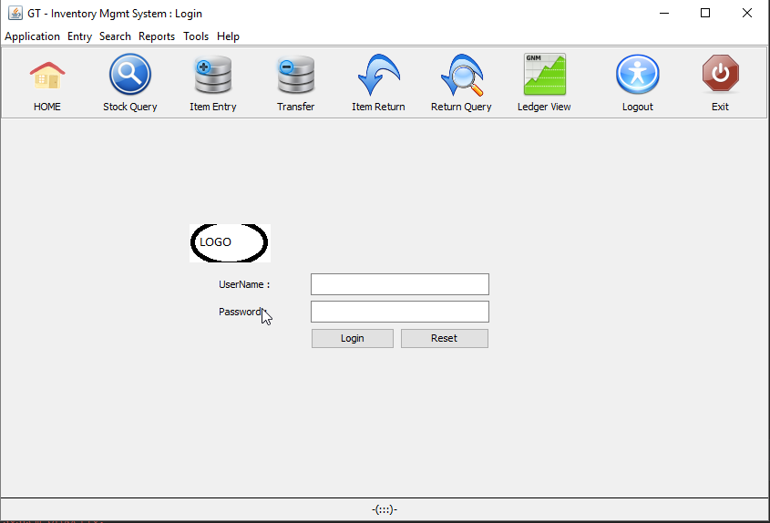
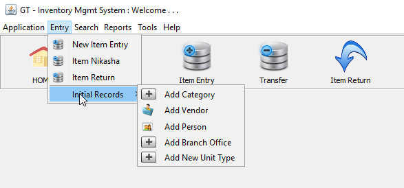
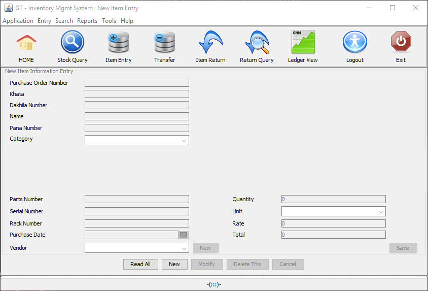
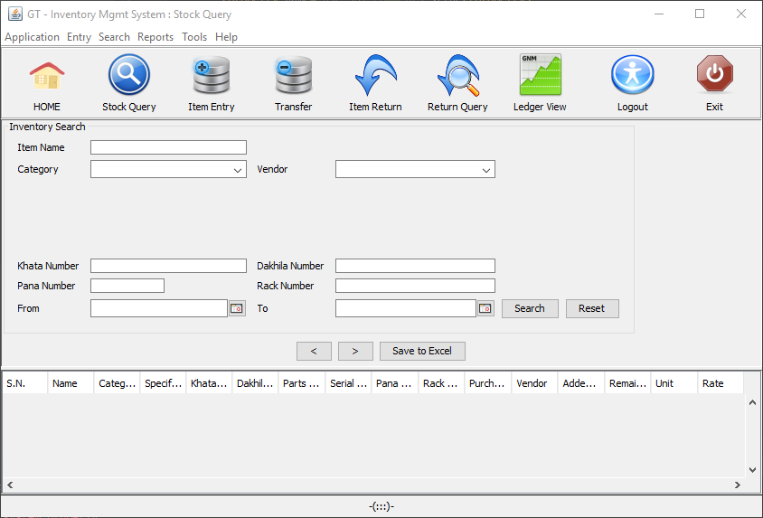
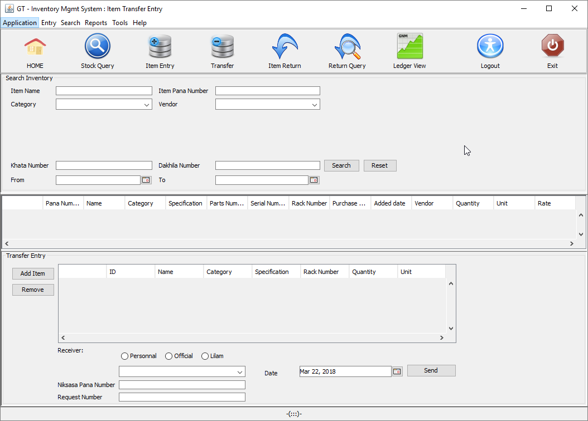
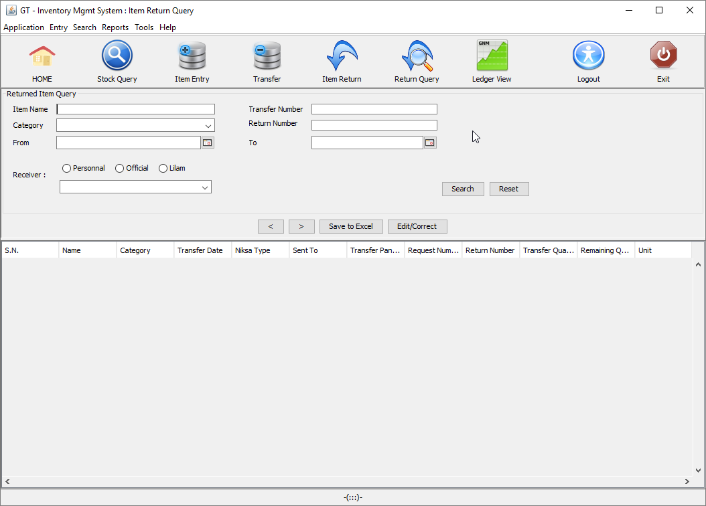

## Inventory Management System - desktop based 

#### This uses following libraries/frameworks
- Swing 
- JGoodies Swing Extension Library
- Hibernate 
- H2 Database 

#### How to run the application
- Clone/Download the project and import into your IDE
- Run com.ca.ui.Main as Java Application
- Enter ADMIN/ADMIN for username and password

##### Configuration and Data
- Use 'Entry' -> 'Initial Records' menu to enter configuration such as  product category, vendor, measurement unit, branch office etc
- Start with "Item Entry" tab to enter inventory items and do Stock Query, Transfer or Sell, Handle Returns of Items etc

## You can use this project as a template to build out your projects! I believe the code is simple enough to understand the overall flow and add/modify modules.

### For any queries :
- Email : gtiwari333@gmail.com
- Blog : http://ganeshtiwaridotcomdotnp.blogspot.com/ 

##### CopyLeft:
- Please feel free to use/modify the code! 
- But make sure to give me credit by keeping the class header or add reference to this GitHub repository.
  

## Snapshots

#### Home/Login Screen

####   Initial Records

####   New Item Entry

####   Stock Query

####   Transfer

####   Return Query

